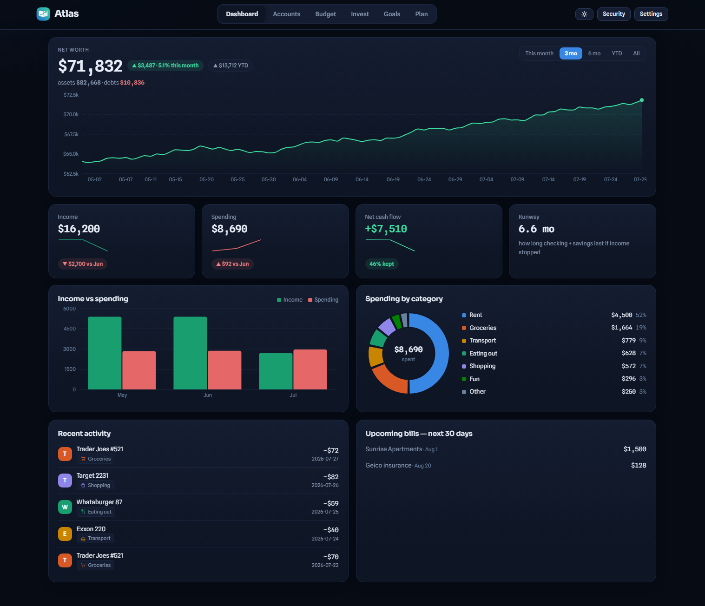
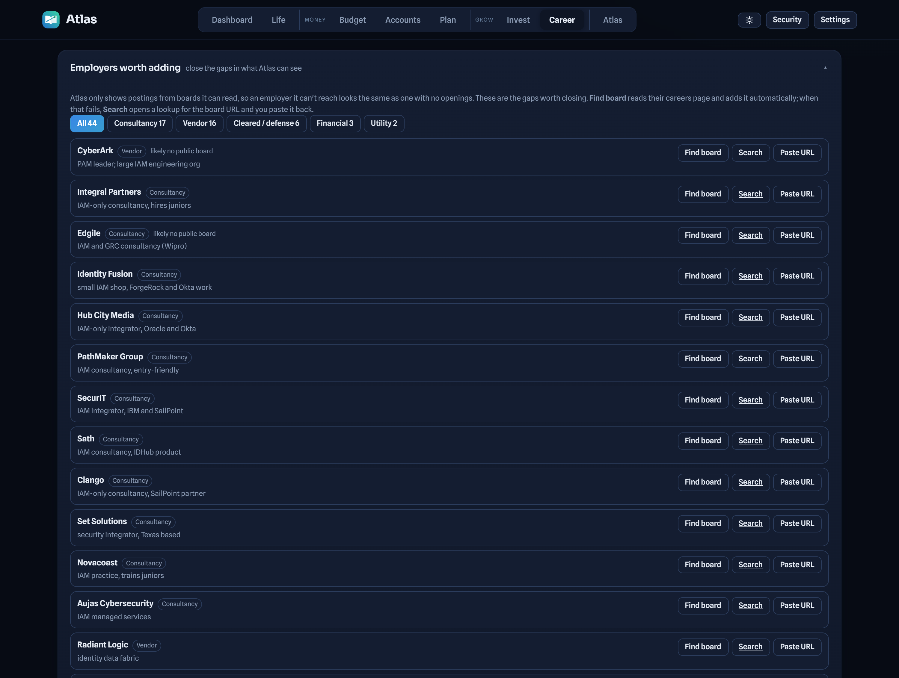
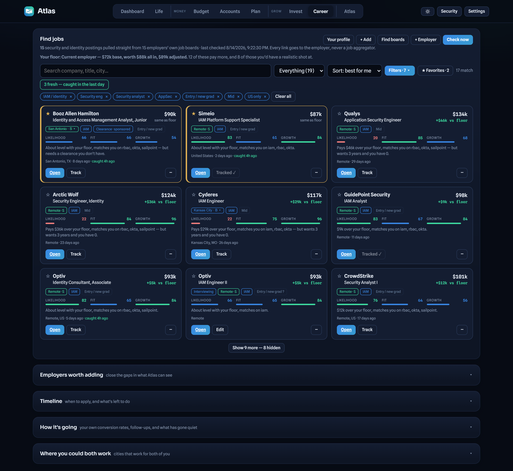
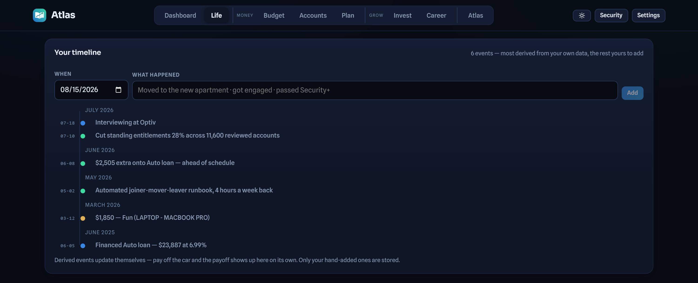
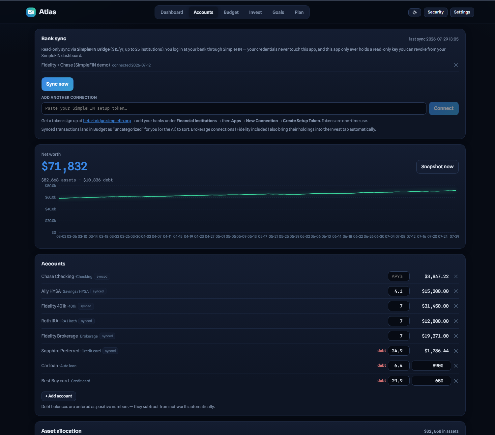
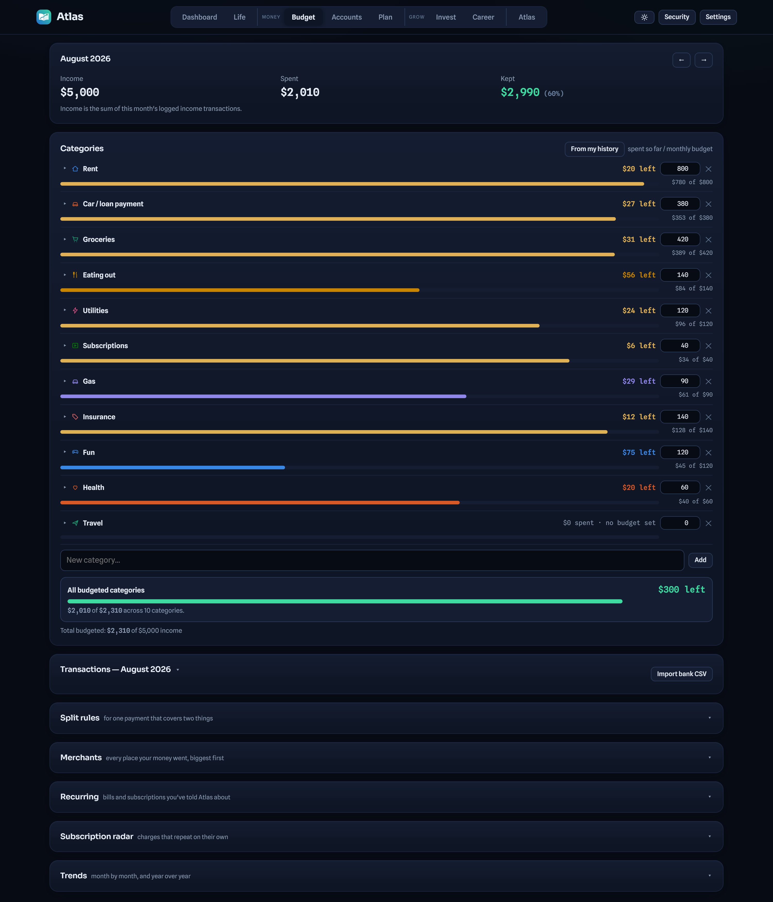
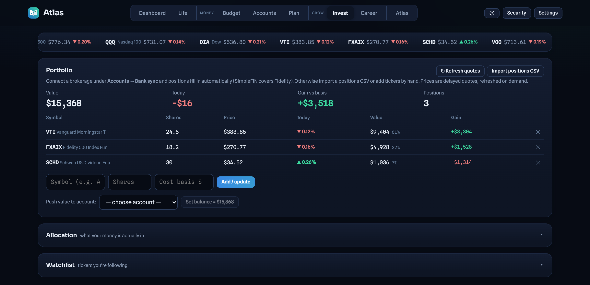
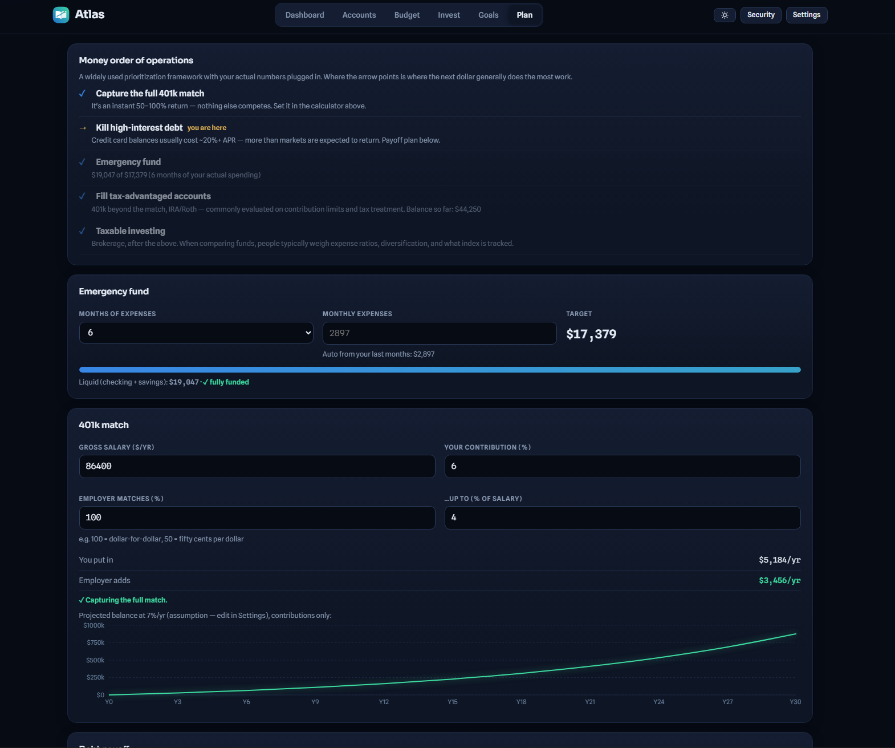
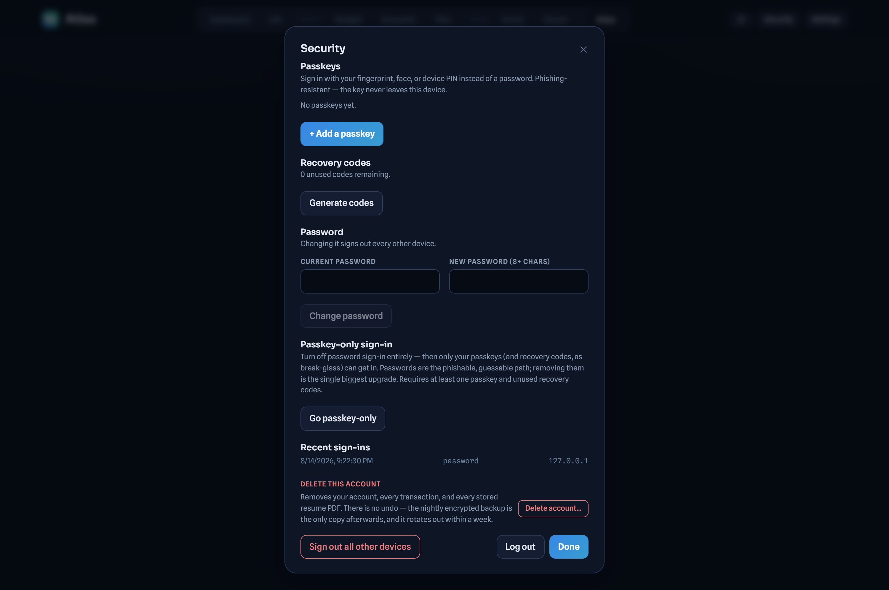

# Atlas

**Self-hosted personal finance and job search, in one app.** Bank sync, budgets,
goals, debt payoff and investments on one side. A job finder that reads employers'
own hiring boards on the other.

> MIT licensed. Runs on your own server, so your financial data never touches
> anyone else's cloud. See [`SETUP.md`](SETUP.md) for the full walkthrough.

They are one app on purpose. Income is the biggest variable in any budget, so
Atlas can answer what a specific job offer would actually do to your runway and
your goal dates. Neither half could answer that alone.



---

## Highlights

| | |
|---|---|
| **Bank sync** | Read only, via SimpleFIN Bridge. Your bank credentials never touch this app. |
| **Transfers handled** | Card payments and account-to-account moves are detected and excluded, so they never double count as both spending and income. |
| **Job finder** | 1,076 live postings from 95 employers' own boards. Never an aggregator. |
| **Board discovery** | Give it a company name and it finds their real hiring board by reading their careers page. |
| **Scored, not blended** | Fit and odds stay separate, so a great job you cannot get yet is visible instead of averaged away. |
| **Offer modelling** | Run a real offer through your actual budget, runway and goal dates. |
| **Passkeys** | WebAuthn sign in, with optional passkey-only mode that turns passwords off entirely. |
| **Multi-user** | Invite gated. Every user's data lives in its own file, invisible to everyone else. |
| **Installable** | Add it to a phone home screen and it behaves like a native app. |
| **Phone alerts** | Push when income lands, a balance runs low, or a new subscription starts billing. Each alert fires once, ever. |

Built with React and Express. No database to run: each user is a JSON file with
revision-checked writes, so two devices can never silently overwrite each other.

---

## The job finder

The part that changed most, and the part worth the most.

The server polls employers' **own public hiring APIs**, the same endpoints their
careers pages call, and caches the results. Every link goes to the employer.
LinkedIn and Indeed are deliberately absent: they block programmatic access and
say so.

**Coverage today:** 1,076 postings across 95 employer boards. 538 of those carry
pay the employer actually published, rather than an estimate.

### Board discovery

The real ceiling on a tool like this is never parsing, it is **discovery**. Atlas
can read any of these boards, but only if it knows the employer's exact hiring
board token, and guessing that from a company name fails about four times in five.

So it stops guessing. Discovery reads the company's own careers page and takes
the board it links to, the way you would by clicking through. Across 95 curated
identity and security employers, guessing found 24. Reading the careers page
found 13 more that guessing could never have reached.

Eight board formats are supported: Greenhouse, Lever, Ashby, Workday,
SmartRecruiters, Workable, Recruitee and JazzHR. That last one publishes no JSON
at all and is parsed from its markup, because several identity consultancies live
there and "no API" is not a good enough reason to leave their roles invisible.

### Employers worth adding

Atlas only shows postings from boards it can read, which has an honest failure
mode: an employer it cannot reach looks exactly like an employer with no openings.

So it names the gaps instead of hiding them. A list of 44 employers worth watching
that Atlas does not already poll, each with a reason. **Find board** runs discovery
on that one employer and adds it. When that genuinely fails, **Search** opens a
lookup scoped to the board vendors so the result is the board URL itself, and you
paste it back.

Every row ends in a definite state, added or not found with the reason, because a
button that quietly does nothing is the exact problem this list exists to solve.



### Two scores, kept separate

- **Fit**: pay adjusted for cost of living, place (remote scores highest, since it
  makes the city question disappear), category growth rate, and how close the role
  is to your specialism.
- **Odds**: how far the role sits from your rung, how much of your actual resume
  overlaps it, and clearance or experience barriers.

Blending them into one number would hide the case that matters most: a great job
you cannot get **yet**, which you want to see rather than have averaged away.



### Favourites

The scores rank by what Atlas can measure. They cannot know you read a posting and
decided it is the one. A star is that judgement, so starred roles sit on top of
every view regardless of score, and **no filter can hide them**. Narrowing the list
can never lose the role you meant to prioritise.

Stars are keyed to the posting URL rather than the requisition number, so a repost
under a new req keeps its star instead of quietly losing the mark.

### Speed to application

Being early beats being perfect. Boards belonging to companies you track are
re-polled **hourly**, while the full sweep stays slower so Atlas remains a polite
guest on other people's APIs. New postings are stamped when first seen, cards show
`caught 3h ago` inside their first day, and a **fresh** button collects everything
caught in the last day so you can be the first human application rather than the
thousandth bot one.

### Filters that agree with their own counts

Every posting carries a role family (identity, SOC, GRC, appsec, offensive, cloud,
security engineering) as counted chips, alongside a level ladder, minimum adjusted
pay, remote, US only, clearance, stale, and new since last visit.

Two rules the filters obey, both learned the hard way:

1. **A count is a promise about what clicking it shows.** Chip counts and the
   visible list run through one shared filter, so a chip reading "108" can never
   land you on 3 results.
2. **Level is a preference, not transient narrowing.** Choosing "entry" is a
   statement about who you are, so it survives jumping to a company's postings.
   It used to be cleared on the jump, which is how a button promising 9 matching
   roles could land you on nine senior requisitions.

### Pay for nearly everything

Postings that publish a range are parsed from the full description. The poll then
takes the **median** real pay per category and rung, and fills in postings that do
not publish. Where a band is too thin it falls back across categories, rescaled
toward that employer's own market and flagged as rougher, so a thin sample of
Bay Area postings cannot claim a utility analyst job pays Bay Area money.

Estimates are always labelled `est`. Never guess which is which.

### Most postings never state a level

Of 613 US postings in a live run, 450 state a level and 163 do not. Filing those
163 under "mid" made an entry filter look like the entry market was empty, which
is false. They are tagged **level not stated** and included by default whenever
the ladder filter excludes mid, behind a visible toggle.

Odds scoring caps the rung gap for these, since penalising a posting for the
employer's vagueness says nothing true about the candidate.

### Application timeline

Knowing **where** to apply is half of it. The other half is **when**.

Campus recruiting is why: full-time pipelines for a May graduate open the previous
August and mostly close by Thanksgiving. Miss that quarter and the good programmes
are not hiring off-cycle in April, however good the resume is. Hiring windows are
parsed and anchored to your graduation month, sorting every tracked target into
window closed, closing this month, open now, opens within two months, or later.

There is a nudge when targets are open and you have not applied to anything. It
goes quiet as soon as something is in flight, because a counter that always shouts
gets ignored.

### Resumes, cover letters and prep

- Up to **five resumes**, each with its own stored PDF, extracted text, and a name
  you choose. A utilities version and a consulting version can live side by side.
- **Tailored resume** rewrites the current one against a specific tracked
  application and drops it into a new tab. The resume you started from is never
  touched.
- **Cover letter** drafts one per application. It opens in an editable box, not
  behind a send button.
- **Interview prep** on any applied or interviewing row: likely technical
  questions, the parts of your resume an interviewer will probe, your weakest spot
  with an honest answer, and what to ask back.
- **Nothing invented.** Every prompt forbids adding a job, date, tool or number
  that is not already in your resume. Read the output anyway. It is your name on it.

On AI written cover letters: employers essentially never run detectors on them.
An applicant tracking system parses yours for keywords and a human skims it. What
loses you the interview is a letter that sounds like every other letter, so use
the draft for structure and facts, then rewrite it in your own voice. The prompt
is deliberately tuned against "I am excited to" filler for that reason.

### Where you could both work

Atlas started as a tool for ranking cities by whether a partner could find work
too, and that survives. Cities rank by what your best tracked target there pays
**after** cost of living, filtered to places where the other half of the search is
real. A $125k Bay Area job ranks below a $72k Toledo one, because $125k at a cost
index of 180 is $69k adjusted while $72k at 84 is $86k.

---

## Life

A timeline of things that actually happened, derived from your own data rather
than typed in: loans opened, unusually large one-off purchases, extra principal
payments, interviews, offers, wins, goals reached, the month your net worth crossed
zero. Derived events update themselves, so paying off the car makes the payoff
appear on its own. Only hand-added events are stored.



---

## The money side



### What syncs, exactly

- Balances for every connected account, on demand.
- Spending transactions arrive **pre-categorised where possible**. Merchants you
  have categorised before are remembered, common merchants match built-in rules,
  and an AI categorise button handles the rest.
- Deposits into checking or savings import as **income**.
- **Card payments and transfers between your own accounts are detected
  automatically** and marked as transfers. They stay in the ledger but are excluded
  from income and spending, so a $750 card payment never counts as $750 of spending
  *and* $750 of income on top of the purchases themselves. Anything mis-flagged
  flips back with a dropdown.
- Every sync logs a net worth snapshot for the dashboard trend.
- **Brokerage holdings** populate the Invest tab automatically where the provider
  returns them (Fidelity does). Anything unsupported still works via CSV import.



### Budget and dashboard

- Per category budgets with actual-versus-planned bars.
- **Month in review**: biggest movers, largest expenses, and a recap that writes
  itself once a month has closed.
- **Merchants** ranks everywhere your money goes and files a whole merchant's
  history under a category in one click.
- **Subscription radar** surfaces charges that repeat monthly at a stable amount.
- **Search** across all months by note, amount or category.
- **Ask Atlas** answers questions across all your data, drafts budgets you can
  apply in one click, and turns "I'm driving from Atlanta to Ruston, my car does
  24 mpg" into a costed, planned purchase. Uses your own Anthropic key, server side.
- **Export** transactions as CSV or your complete data as JSON. Bank tokens are
  never included, because they never leave the server at all.



### Invest

- Market strip with delayed quotes, refreshed through the server so nothing third
  party runs in your browser.
- Holdings with live value, day change, and gain against cost basis, plus an
  allocation donut.
- Import positions as CSV from any brokerage. No credentials involved.
- Watchlist and an optional AI market brief, informational only.



### Plan

Goals with pace to target that tells you what you would need per month to hit a
date. Money order of operations, emergency fund sizing, 401k match checking, debt
payoff with promotional APR tracking, purchase planner, tax estimate, and an offer
modeller that runs a real offer through your actual budget.

---

## Phone alerts

Atlas can notify your phone when money lands, when checking and savings drop under
a line you set, when a single charge is unusually large, when a **new subscription**
has quietly billed three months running at the same amount, when a category goes
over budget, or when a watched bill is a few days out.

The design constraint is the whole feature. A notification channel that cries wolf
gets muted within a week, and then you miss the real one too. So:

- **Every alert is sent once, ever.** Not once per sync, not once a day. Once.
- **Turning it on never replays your history.** The first pass runs silently and
  records what already exists as seen, so enabling alerts on an account with two
  years of transactions sends nothing at all. Changing a threshold re-baselines
  the same way, so lowering your "large charge" line cannot retro-fire on old rows.
- **Thresholds fire on the crossing, not the state.** Sitting under your low-balance
  line for a fortnight is one notification, not fourteen, and recovery has a buffer
  so hovering on the line cannot flap.
- **Several at once become one notification**, rather than six separate buzzes.
- **The payload carries only the line of text you see.** No balances, no account
  names beyond what the message says, because notifications sit on lock screens.

Alerts are evaluated right after each bank sync, and hourly for the time-based ones
like a bill coming due. It is off until you turn it on, per device.

Push needs a VAPID key pair. Generate one with `npx web-push generate-vapid-keys`,
put it in `.env` as `VAPID_PUBLIC`, `VAPID_PRIVATE` and `VAPID_SUBJECT`, and restart.
Without it the panel just says push is not configured. On iPhone, notifications work
only once the app is added to the home screen, which is an Apple restriction rather
than a limit here.

## Security



- **Passkeys** (WebAuthn: fingerprint, face or device PIN), which are phishing
  resistant, with one time recovery codes.
- **Passkey-only mode** turns password sign in off entirely. Passwords are the
  phishable, guessable path, so removing them is the single biggest upgrade.
- Scrypt hashed passwords otherwise, with in-app password change that revokes
  every other session.
- **Bank access tokens encrypted at rest** with AES-256-GCM, and revocable from
  your SimpleFIN dashboard at any time.
- Per user session revocation ("sign out everywhere") and a sign-in audit trail.
- CSP, security headers, and a same-origin check on all state-changing requests
  as CSRF defence in depth over SameSite cookies.
- Rate limited auth, AI and quote endpoints, with per account brute force backoff.
- Revision checked saves, so two devices cannot silently overwrite each other.

Bank login happens at SimpleFIN, not here. This app only ever holds a read-only
key. All secrets stay server side in `.env`, which is gitignored. Never commit
`.env`, `server/certs/`, `users.json` or `data-*.json`, and back up the data files,
because they *are* the database.

See [`DEPLOY-ORACLE.md`](DEPLOY-ORACLE.md) for VM hardening and encrypted backups.

---

## Run it locally

```bash
npm install
cp .env.example .env      # on Windows PowerShell: copy .env.example .env
npm run dev               # app at http://localhost:5173
```

Minimum `.env` to try it: set `SESSION_SECRET` and `INVITE_CODE` to anything.
Leave bank sync and AI unconfigured if you just want to click around. The server
reads `.env` once at startup, so restart it after editing.

If `npm run dev` fails with `EADDRINUSE`, an older copy of the server is still on
port 3001. Close that terminal and rerun.

Then:

1. Open the app and **create an account**. The first account on a fresh server
   needs no invite code. Everyone after that needs `INVITE_CODE`.
2. Add accounts and budgets by hand, or connect real banks: sign up at
   [SimpleFIN Bridge](https://beta-bridge.simplefin.org) ($15/yr), add your
   institutions, create a setup token, and paste it into the Accounts tab.
   Nothing goes in `.env`.
3. Add `ANTHROPIC_API_KEY` for AI categorisation, budget recommendations, resume
   tailoring and the Plan review.

### Tests

```bash
npm test
```

366 assertions, no server or browser needed. They pull the real functions out of
the source rather than testing a copy, so they fail if the source drifts. They
cover the bugs that were hardest to see, including card payments counted as both
spending and income, short city names false matching ("LA" matching Dallas), and
gap months counting as zero spending and dragging a median to nothing.

---

## Multi-user

- `INVITE_CODE` gates registration. Rotate it whenever you like.
- Each user gets a separate login, a separate data file, and separate bank
  connections. Nobody can see anyone else's data.
- Bank sync is per user, so each person brings their own SimpleFIN token.
- One caveat worth knowing: everyone shares **your** Anthropic key. It costs cents,
  but they are your cents.

## Deploying

See [`DEPLOY-ORACLE.md`](DEPLOY-ORACLE.md) for a full Oracle Cloud walkthrough
with systemd, Caddy and HTTPS. Short version for any host: build, run `npm start`,
put HTTPS in front, set `FORCE_SECURE_COOKIE=1`, and point `DATA_DIR` at something
persistent that gets backed up.

## Known limits

Stated plainly, so you do not over-trust it.

- **Coverage is employer by employer.** Atlas reads 95 boards. Plenty of employers
  publish nothing machine readable at all (iCIMS, Taleo and SuccessFactors among
  them), and for those, discovery will honestly tell you it failed rather than
  invent a result.
- **Pay is an estimate unless the posting states it**, and it is labelled when it is.
- **Clearance detection is weaker for Workday employers**, whose list endpoint
  returns a very short description. Check the posting.
- **Genuinely entry-labelled roles are scarce** outside the autumn new-grad window.
  That is the market, not a bug, and more boards will not manufacture junior
  requisitions that do not exist.
- **Earlier versions synced through Teller.** Teller withdrew its API in July 2026,
  so SimpleFIN Bridge is the supported path. The Teller endpoints remain so any
  existing enrollment keeps working until those servers go dark.
