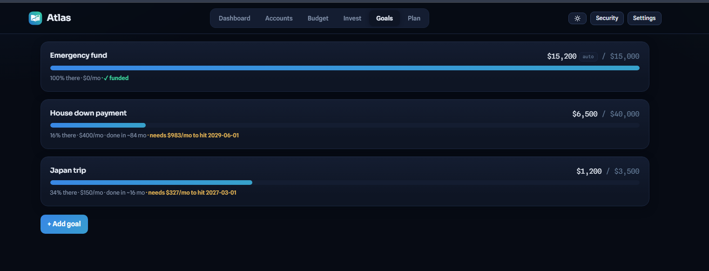

# Atlas — self-hosted personal finance, multi-user

> MIT-licensed. Run it on your own server; your financial data never touches
> anyone else's cloud. See `SETUP.md` for the full setup walkthrough.

React + Express. Real bank sync (SimpleFIN, read-only) with automatic
transfer detection (credit-card payments and account-to-account moves never
double-count as spending/income) and auto-categorization (learned from your
history + built-in merchant rules), an Invest tab with live delayed quotes +
watchlist + Fidelity positions-CSV import, AI categorization, budgeting, and
an **Ask Atlas** dashboard assistant that answers questions across all your
data, drafts budgets you can apply in one click, and turns "I'm driving from
Atlanta to Ruston, my car does 24 mpg" into a costed, planned purchase (your
Anthropic key, server-side), a **month-in-review** card (biggest movers,
largest expenses, budget verdicts, optional AI recap), full dashboard with
donut breakdowns and click-through income/spending history, budgets, goals,
debt payoff with promo-APR tracking, purchase planner, subscription radar
(auto-detects recurring charges), cross-month transaction search, and one-click
CSV/JSON export. **Installable** — add it to your phone's home screen and it
runs like a native app.
Registration is invite-code gated so you can share with friends/family —
every user's data lives in its own file, invisible to other users.


**Security:** passkeys (WebAuthn — fingerprint/face/PIN, phishing-resistant)
with one-time recovery codes, and an optional **passkey-only mode** that turns
password sign-in off entirely; scrypt-hashed passwords otherwise, with in-app
password change that revokes every other session; bank access tokens encrypted
at rest (AES-256-GCM); per-user session revocation ("sign out everywhere") and
a login audit trail; CSP + security headers + a same-origin check on all
state-changing requests (CSRF defense-in-depth over SameSite cookies);
rate-limited auth/AI/quotes endpoints with per-account brute-force backoff;
revision-checked saves so two devices can never silently overwrite each other.
Manage all of it from the **Security** panel in-app. See `DEPLOY-ORACLE.md`
for VM hardening + encrypted backups.

**Already deployed?** `SETUP.md` is the step-by-step checklist for getting a
live instance fully configured — passkeys, bank sync, AI key, investments,
backups.

## Screenshots





## Test locally first (do this before deploying)

```
npm install
cp .env.example .env      # macOS/Linux — then edit it
npm run dev               # app at http://localhost:5173
```

On Windows PowerShell, the copy step is:

```
copy .env.example .env
```

`npm run dev` fails with `EADDRINUSE` if an older copy of the server is still
running on port 3001 — close that terminal (or `Stop-Process`) and rerun.
The server reads `.env` once at startup, so restart it after editing.

Minimum .env to test: set `SESSION_SECRET` and `INVITE_CODE` to anything.
Leave bank sync and AI unconfigured if you just want to click around.

1. Open the app → **Create account** — the FIRST account on a fresh server
   needs no invite code. Everyone after that needs `INVITE_CODE`.
2. Add accounts/budgets manually, or connect real banks: sign up at
   https://beta-bridge.simplefin.org ($15/yr), add your institutions, create a
   setup token under **Apps → New Connection**, and paste it into the Accounts
   tab. Nothing goes in `.env`.
3. Add `ANTHROPIC_API_KEY` to test AI categorize / budget recommendations /
   the Plan review.

> **On Teller:** earlier versions of this app synced through Teller. Teller
> withdrew its API product in July 2026 and no longer accepts signups, so
> SimpleFIN Bridge is the supported path. The Teller endpoints remain in the
> server so any existing enrollment keeps working until those servers go dark.

## What syncs, exactly
- Balances for every connected account, on demand (Sync now)
- Spending transactions arrive **pre-categorized where possible** — merchants
  you've categorized before are remembered, common merchants match built-in
  rules, and the **AI categorize** button handles the rest
- Deposits into checking/savings → imported as **income** transactions
- Credit-card payments and transfers between your own accounts are detected
  automatically (payment/transfer keywords, inflows on card accounts, and
  equal-and-opposite pairs across accounts) and marked as **transfers** — kept
  in the ledger but excluded from income and spending, so a $750 card payment
  never counts as $750 spending *and* $750 income on top of the purchases
  themselves. Anything mis-flagged flips back via the type dropdown in Budget.
- Every sync logs a net-worth snapshot for the Dashboard trend
- **Brokerage holdings**: accounts that return a `holdings` array (Fidelity
  does) populate the Invest tab automatically — symbol, shares, cost basis.
  Anything unsupported still works via the Invest tab's positions-CSV import

## Invest tab
- Market strip (S&P 500 / Nasdaq 100 / Dow) with delayed quotes, refreshed
  through the server (nothing third-party runs in the browser)
- Holdings with live value, day change, and gain vs cost basis; allocation
  donut; push the total into any investment account's balance
- **Fidelity / any brokerage**: export Positions as CSV from the brokerage
  site and import — no credentials involved
- Watchlist (stocks, ETFs, `BTC-USD` etc.) and an optional AI market brief
  (web-searched, informational only)

## Beyond the basics
- **Subscription radar** (Budget tab): charges that repeat monthly at a stable
  amount are surfaced automatically — "Watch" one to see it in Upcoming bills
  (without double-logging; the real charges keep arriving via sync/CSV), or
  dismiss it.
- **Search** (Budget tab): type in the search box to look across *all* months
  by note, amount, or category.
- **Insights** (Dashboard): biggest category changes vs last month + largest
  individual expenses in the selected range.
- **Export** (Settings): transactions as CSV, or your complete data as JSON.
  Bank tokens are never included — they never leave the server at all.
- **Change password** (Security panel): requires the current password and
  signs out every other device.

## Multi-user model
- `INVITE_CODE` in `.env` gates registration; rotate it anytime
- Each user: separate login, separate `data-<id>.json`, separate bank
  connections; nobody can see anyone else's data
- Passwords are scrypt-hashed; sessions are HMAC-signed httpOnly cookies
- Note: everyone shares YOUR Anthropic key (costs cents, but it's your cents).
  Bank sync is per-user — each person brings their own SimpleFIN token

## Deploying
See **DEPLOY-ORACLE.md** for the full Oracle Cloud walkthrough (systemd +
Caddy HTTPS + Oracle's firewall quirks). Short version for any host: build,
run `npm start`, put HTTPS in front, set `FORCE_SECURE_COOKIE=1`, and point
`DATA_DIR` somewhere persistent that gets backed up.

## Security notes
- Bank login happens at SimpleFIN, not here — your bank credentials never touch
  this app. It only ever holds a read-only access key, encrypted at rest with
  AES-256-GCM and revocable from your SimpleFIN dashboard
- All secrets stay server-side in `.env` (gitignored)
- Never commit `.env`, `server/certs/`, `users.json`, or `data-*.json`
- Back up the data files; they ARE the database
